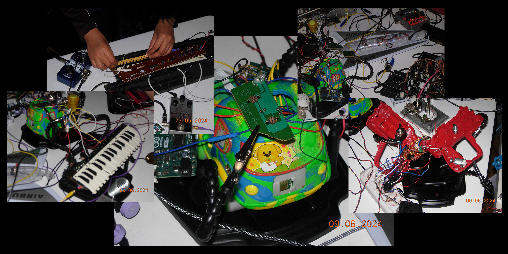
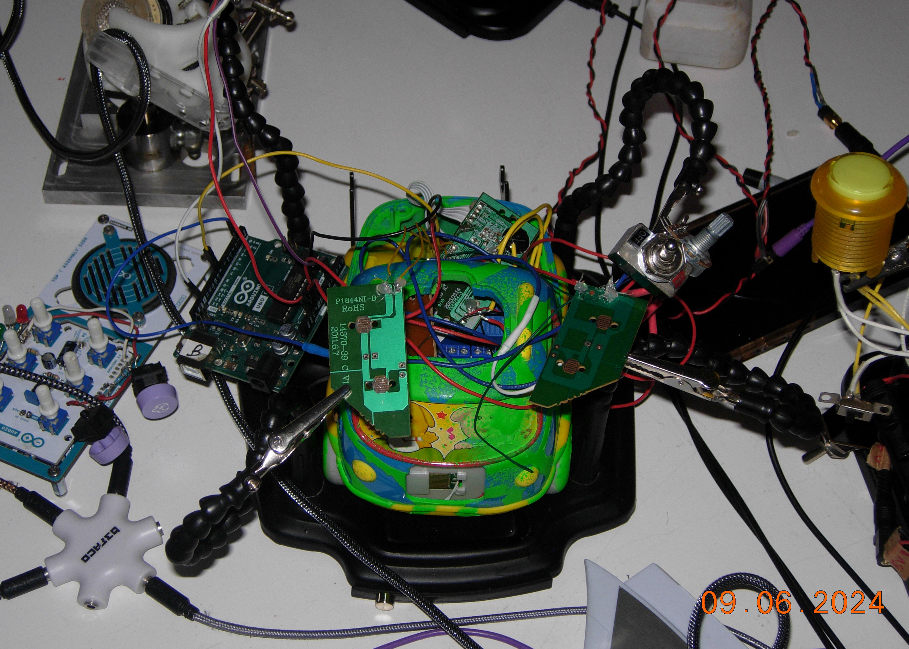
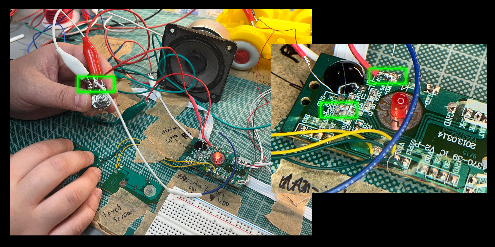
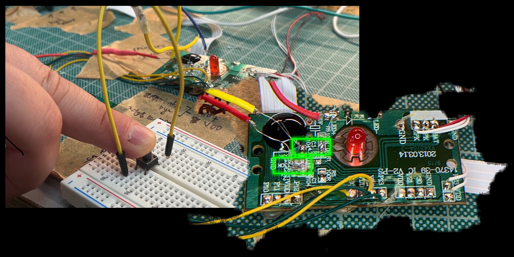

# Valentino

## Intro: Circuit Bending

Circuit Bending is the act of modifying existing, often discarded, electronics to give them new life. 
We started experimenting with this technique with our previous project, GAIA, but this time we decided to delve into converting those electronics into sound and visual instruments.

The first step was to collect raw materials: we looked around for unused, non-working, discarded digital cameras, toys and monitors. Some of these electronics were gifted by friends, many picked up from trash or bought cheaply at Dels Encants.

Then it was time to get hands-on: the process of circuit bending is a delicate balance between freestyle experimentation and reverse engineering. Our process involved freely searching for glitches, features, and distortions in the original hardware, while at the same time preserving and not damaging the original components. 
It is a trial-and-error procedure that can yield unexpected results, both in terms of unlocking new features in the device and potentially breaking it completely. 

This unpredictability is precisely why we are fascinated by this technique and find it unique: it dances on the spectrum of possibilities and experiments and designs over something that already exists, creating a methodology based on adaptability, hacking, reusing, and recycling—concepts that are difficult to find in other contexts.

This vision also requires care and attention, creating a magical tension between what the artifact could or could not become. Valentino is our first accomplished instrument, an experiment that passed away and came back to life multiple times due to its fragility, but eventually turned into a powerful sound and beat-making instrument.

---

## Step 1: Open the Interface and Explore the Electronics

After disassembling the toy, we started to explore its default features. Valentino has different samples activated autonomously with an internal timer or by external buttons, which are actually capacitive sensors placed on multiple internal boards. Our first objective was to list all the possible sounds and map the relationships between these sounds and the original electronics.

Next, we aimed to understand how to control and modify the sounds. We examined the main board to identify where the information was passing in order to intervene: we created bridges and small shorts on the circuit, mostly with cables or by simply altering the current by placing pliers between pins and resistors. 

Slowly, we achieved two main modifications: we found a resistor that could change the speed and pitch of the sounds, and another resistor that acted like a clock, which could stop the sound by connecting with a pin on the board.

---

## Step 2: Hacking and Adding Features

Having identified these possibilities, we decided to add external controls to interact with them.

- **Pitch Control**: To precisely control the speed of the sounds, we added an extra potentiometer by connecting one pin to the resistor, one to the VCC, and the other to the ground of the original board. We first tested this with a breadboard and later directly soldered the cables to the board.
- **Clock**: We noticed that by interrupting the signal multiple times while a sound was playing, we could create a "beat" sound. Combining this feature with the pitch control, we found that by deeply slowing the sound, it produced an even more distinctive beat, closer to a kick. To highlight this feature, we used relays to quickly connect and disconnect the two sides of the circuit in a more stable way. The relays are controlled by an additional Arduino, which also controls the speed of this through a potentiometer. In the final version, the “relay mode” is activated by another external switch.
- **Amplification**: To amplify the signal, we replaced the signal output from the original small speaker with a mini jack output, allowing us to connect Valentino to headphones, modular synths, effects, or other sound systems. 
This output has been obviously placed in the fuel tank door.

---

## Step 3: Wrapping Up and Playing

After setting up the modifications, we secured the delicate connections we added to the boards with hot glue.

The final touch for Valentino was spraying over the original body (as traditional in circuit bending) and finding a new, (kind of) stable structure for partially placing the electronics back into the case.

To get the best out of this new instrument, we had to spend lot of time learning how to actually play it, a fun process in discovering new ways to interact with this sound machine.

You can see our final result on this slice of our video "RUIDO" (https://www.youtube.com/embed/4bKsXcgrkUM?si=6MoWPt6UlIRRIQb2&amp;start=1500"). 

---
